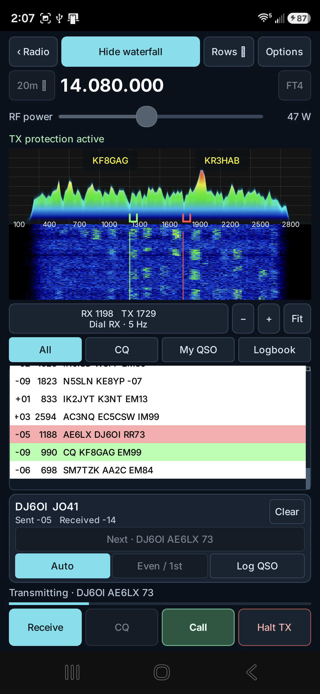

# QK4 Mobile v1.0.5

QK4 Mobile v1.0.5 adds native phone-based FT8/FT4 reception and standard
QSO transmission, expands the shared ADIF logbook with SSTV and QRZ
integration, and refines CTR2-MIDI control, navigation, macros, and panadapter
behavior.

  

<em>A confirmed FT4 QSO with DJ6OI at 14.080 MHz. The screen shows the sent −05 and received −14 reports, received RR73, live spectrum/waterfall, calibrated TX protection, and integrated Log QSO action.</em>

## FT8 and FT4

- Receive and decode FT8/FT4 directly from the K4 Main RX audio stream.
- Call stations or send CQ with standard timed GFSK transmission through the existing K4 audio transport.
- Calculate signal reports automatically using the WSJT-X 2.7.0 method and 2500 Hz reference bandwidth.
- Start a call in the current eligible period using WSJT-X-style late-start timing.
- Automatically select DATA-A while FT8/FT4 is open, retain it across band changes, and restore the operator's original mode on exit.
- Resume reception automatically after calibration and transmitted periods.
- Select older decodes without an artificial age restriction.
- Use the live 3 kHz spectrum/waterfall, independent RX/TX tone markers, touch tuning, zoom, selectable row density, All traffic, and frequency-focused My QSO view.
- Hide the waterfall to expand the activity list; redundant callsigns above the waterfall have been removed.
- Use common FT8/FT4 frequencies or enter any valid K4 frequency.
- Complete standard automatic exchanges and save successful contacts to the shared logbook.

## Digital transmit calibration and protection

- Share one TX audio calibration between FT8 and FT4 for the same radio and audio setup.
- Reduce audio drive below the former −30.1 dB limit when required by the K4.
- Accept stable K4 raw ALC readings from 3 through 5 without unnecessary fine adjustment.
- Retain automatic drive reduction, PCM headroom checks, missing-meter detection, excessive-ALC protection, timed-audio watchdogs, and reliable return to RX.
- Keep SSTV calibration separate from FT8/FT4 calibration.

## CTR2-MIDI FT8/FT4 control

- Assign **Switch RX/TX tone** and **Set tone frequency** to one button's short and long press.
- Turn the assigned wheel to move a dashed preview, then commit the selected tone.
- Set TX to enable Hold TX or set RX to focus My QSO near the selected receive frequency.
- Preserve existing wheel mappings and migrate older separate RX/TX button assignments.
- Handle the CTR2's positive NoteOn release events so short and long button actions execute reliably.
- Prevent Rate, KHZ, band-step, and VFO actions from changing radio frequency until the operator explicitly selects an RF digit.
- Recover old coarse tone steps to 5 Hz and limit tone steps to 1, 5, 10, 25, or 50 Hz.

## Shared logbook and QRZ

- Use one ADIF logbook from FT8/FT4, SSTV, and the main radio screen.
- Log SSTV Receive and Transmit contacts through compact editable callsign review panels.
- Long-press DXLIST to open the logbook from the radio screen.
- Add or edit contacts with arbitrary supported ADIF details.
- Configure automatic QRZ Logbook uploads or manually send an unsent contact.
- Store the QRZ API key in Android Keystore-encrypted storage and provide Show/Hide control during setup.
- Display a locked read-only success checkbox for contacts confirmed by QRZ.
- Export standard QRZ upload status and upload-date ADIF fields.

## Navigation and radio synchronization

- Make Android Back return from setup pages and nested editors instead of closing the application.
- Hide the software keyboard on the first Back action when appropriate.
- Refresh the complete displayed K4 state after an app or CTR2 macro, including frequencies, modes, filters, levels, RIT, power, and menu state.
- Correct QRhi resource-update ordering for reliable GPU panadapter rendering.
- Make touch input on Pan A tune VFO A and touch input on Pan B tune VFO B.
- Retain the compact phone layout and portrait-only FT8/FT4 policy on phones.

## Validation and scope

The release-signed ARM64 build uses Android version code 32. It has been
installed and tested on a Samsung Galaxy S26 Ultra with a live Elecraft K4.
Device testing confirms the FT8/FT4 band-mode correction and the current phone
test plan. The captured FT4 screen documents a completed on-air exchange and
integrated log workflow.

The Android tablet control layout and iPhone/iPad port derived from PR #3 remain
in separate development branches pending their own builds and physical-device
acceptance. They are not included in the v1.0.5 Android phone APK.
